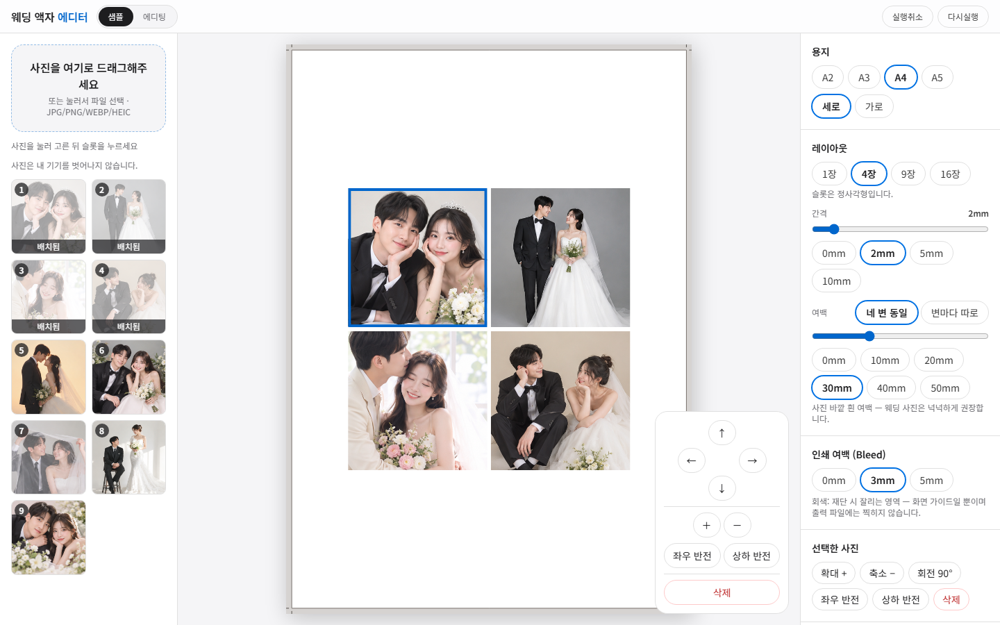
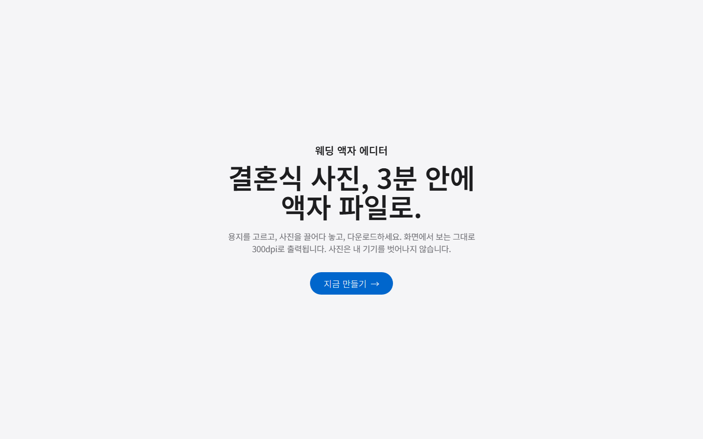
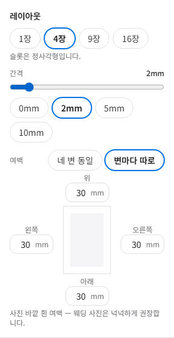
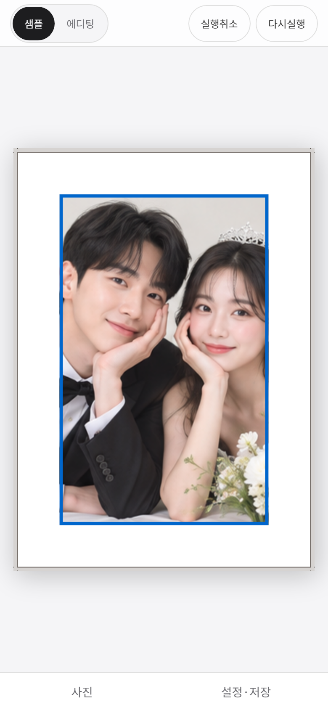

# 웨딩 액자 에디터 (Wedding Frame Editor)

결혼식 사진을 올려 액자 출력용 **300dpi 인쇄 파일**(PDF/PNG/JPG)을 브라우저에서 바로 만드는 편집기입니다.
화면에 보이는 그대로 출력되고(WYSIWYG), 사진은 서버로 올라가지 않고 내 기기 안에서만 처리됩니다.



## 이렇게 씁니다

### 1. 시작하기

랜딩 화면에서 **지금 만들기**를 누르면 에디터가 열립니다.



### 2. 사진 배치하기

- 왼쪽 패널에 사진을 끌어다 놓거나(JPG/PNG/WEBP/HEIC) 눌러서 고릅니다. 모바일은 **눌러서 사진 추가하기**를 누릅니다.
- 사진을 캔버스 슬롯으로 드래그하면 슬롯을 꽉 채우도록(cover) 자동으로 맞춰집니다. 모바일은 사진을 누른 뒤 슬롯을 누르면 됩니다.
- 사진이 없어도 상단의 **샘플** 버튼을 누르면 샘플 웨딩 사진 9장이 빈 슬롯에 채워져 바로 기능을 체험할 수 있습니다. **에디팅**으로 돌아가면 샘플만 걷히고 내 사진은 그대로 남습니다.

### 3. 선택한 사진 다듬기

캔버스에서 사진을 누르면 파란 테두리로 선택되고, 캔버스 오른쪽 아래에 **사진 도구 상자**가 나타납니다(데스크탑).

| 도구 | 동작 |
| --- | --- |
| ↑ ↓ ← → | 슬롯 안에서 사진을 2mm씩 옮겨 보이는 부분을 조절 (슬롯 밖으로 빈틈이 생기는 방향은 멈춤) |
| ＋ / － | 확대 / 축소 |
| 좌우 반전 · 상하 반전 | 사진 뒤집기 |
| 삭제 | 슬롯에서 사진 제거 (Delete 키도 같은 동작) |

사진을 직접 드래그해 슬롯 안에서 보이는 부분을 옮길 수도 있습니다.
오른쪽 설정 패널의 **선택한 사진**에는 회전 90°, **필터**에는 흑백이 있습니다.

### 4. 용지·레이아웃·여백 정하기



- **용지**: A2~A5, 세로/가로
- **레이아웃**: 1·4·9·16장 (1장은 용지 꽉 채움/정사각형 선택), 사진 사이 간격
- **여백**: *네 변 동일*(슬라이더·프리셋) 또는 *변마다 따로*(위·아래·왼쪽·오른쪽을 각각 mm로 입력).
  한 변의 여백은 '네 변 동일'의 최댓값을 넘지 못하게 막아 사진 영역이 지나치게 작아지지 않게 했습니다.
  입력값은 Enter를 누르거나 입력칸을 벗어날 때 반영되어, 타이핑 도중 사진 크기가 바뀌지 않습니다.
- **인쇄 여백(Bleed)**: 0/3/5mm — 화면의 회색 영역은 재단 가이드일 뿐 출력 파일에는 찍히지 않습니다.

### 5. 다운로드

설정 패널 맨 아래에서 **PDF / PNG / JPG**로 내려받습니다. 출력 크기는 용지 실측 그대로입니다(A4 → 210×297mm, 300dpi 2480×3508px).

### 모바일

모바일에서는 캔버스를 넓게 쓰고, 사진·설정은 하단 탭의 바텀시트로 엽니다. 두 손가락으로 사진을 확대/축소할 수 있습니다.



## 디자인

`DESIGN.md`(Apple 스타일 분석)를 기준으로, 사진이 주인공인 갤러리 톤을 씁니다 — 파치먼트 배경 + 흰 패널, 인터랙티브 요소는 Action Blue 한 색, 크롬엔 그림자·장식 없음. 토큰은 `tailwind.config.ts`, 폰트는 `next/font`로 자체 호스팅한 Noto Sans KR. 코드 작성 규칙은 `CLAUDE.md`.

## 핵심 원칙

- **mm가 진실의 원천** — 모든 상태 좌표는 mm로 저장, 화면은 `mm × screenScale`, 추출은 `mm / 25.4 × 300` (`src/lib/convertMM.ts`)
- **완전 클라이언트 사이드** — 사진은 서버로 전송되지 않음. 원본은 IndexedDB, 편집은 장변 2000px 다운스케일본 사용
- **슬롯 고정 + 내부 크롭** — 고정 레이아웃 슬롯에 clip된 사진을 내부에서 이동/확대 (`src/lib/layoutCalc.ts`)

## 실행

```bash
npm install
npm run dev        # http://localhost:3000
npm run typecheck  # tsc --noEmit
npm run build
```

## 구현 현황 (1차 MVP)

| 영역 | 상태 |
| --- | --- |
| 용지 선택(A2~A5) · 세로/가로 토글 | ✅ |
| 레이아웃 1·4·9·16장 · 정사각형 슬롯(1장은 정사각형/직사각형 선택) · gutter 슬라이더(용지비율 프리셋) | ✅ |
| 상하좌우 여백 — 네 변 동일(용지비율 프리셋, 기본 A4 기준 30mm) 또는 변마다 개별 조절(한 변 상한 = 네 변 동일 상한) | ✅ |
| 캔버스 사진 도구 상자 — 이동(↑↓←→)·확대/축소·반전·삭제 (데스크탑) | ✅ |
| 샘플 모드 — 샘플 사진 9장으로 바로 체험, 에디팅 복귀 시 샘플만 제거 | ✅ |
| Bleed 0/3/5mm · 재단선 · 재단 표시선 (화면 가이드 전용, 출력물엔 미포함) | ✅ |
| PNG/JPG/PDF 추출 — 모바일 포함, 페이지=용지 실측, 대용량은 기기 한계에 맞춰 자동 축소 | ✅ |
| 슬롯 드롭 → cover 자동 채움 · 내부 이동/회전·반전 | ✅ |
| 터치: 탭-투-배치 · 두 손가락 핀치 줌 | ✅ |
| 라이브러리 순번 배지 · 배치된 사진 명암 표시 · 썸네일 재드래그 중복 방지 | ✅ |
| 업로드 파이프라인 (HEIC 변환·EXIF 보정·원본/편집용 이중 관리) | ✅ |
| Undo/Redo (zundo, 50단계) · Delete/ESC/Cmd+Z 단축키 | ✅ |
| 자동 저장·복구 | ❌ 제거됨 — 원본 사진은 에디터 진입 시 IndexedDB에서 정리 |
| 사진 테두리 디자인 — 폴라로이드/인생네컷 | 🔲 구현됨, `PHOTO_FRAME_ENABLED`로 숨김 |
| 목업 미리보기 — 조판을 흰 액자로 선반/벽 장면에 합성 | 🔲 구현됨, `MOCKUP_PREVIEW_ENABLED`로 숨김 |
| 액자/매트지 미리보기 | 🔲 구현됨, `FRAME_PREVIEW_ENABLED`로 숨김 |
| 추출 시 원본(originalKey) 교체 렌더링 | ✅ |
| 흑백 필터 (사진 선택 시 필터 패널 노출) | ✅ |
| 자유 배치 텍스트 (용지 위 드래그 배치, 글자 크기·색상·정렬·굵기 설정, 출력물 반영) | 🔲 구현됨, `TEXT_ENABLED`로 숨김 |
| 밝기/대비/채도 필터 | 2차 릴리스 |
| AI 얼굴 인식 배치 · 커스텀 레이아웃 편집기 | 3차 릴리스 |

## 폴더 구조

```
src/
├─ app/                 # 랜딩(/), 에디터(/editor)
├─ components/
│  ├─ Editor.tsx        # 3패널(데스크탑)/바텀시트(모바일) 통합, 캔버스는 단일 마운트
│  ├─ StartLink.tsx     # 랜딩 "지금 만들기" 버튼(여는 중 표시)
│  ├─ canvas/           # PaperCanvas (인쇄 가이드·슬롯·사진 노드), PhotoToolbar, FramePreview
│  └─ panels/           # LibraryPanel, SettingsPanel, FramePanel
├─ stores/              # editorStore(zundo), frameStore(미리보기 전용)
├─ lib/                 # convertMM, paperSizes, layoutCalc, frames,
│                       # imagePipeline, exportPdf, storage, samples
├─ sample_picture/      # 샘플 모드용 사진
└─ types/
```

## 출력 파일 규칙

- PDF/이미지 페이지 크기는 **용지 실측 그대로**입니다 (A4 → 정확히 210×297mm, 300dpi 2480×3508px).
- 화면의 회색 bleed·재단선·안전선·재단 표시선과 액자는 **가이드일 뿐 출력물에 포함되지 않습니다.**
  추출 직전 `PaperCanvas`를 `mode='export'`로 다시 그린 뒤 재단 영역만 crop합니다.
- 화면의 재단 여백(bleed)은 출력 파일에 포함되지 않습니다. 출력 크기는 항상 용지 실측입니다.

## README 자동 갱신

`git push` 직전에 `.githooks/pre-push`가 `readme-updater` 서브에이전트(`.claude/agents/readme-updater.md`)를
실행해 README를 코드 변경과 맞춥니다. 최초 1회만 아래 설정이 필요합니다.

```bash
git config core.hooksPath .githooks
```

README가 수정되면 push가 중단됩니다. 내용을 확인하고 커밋한 뒤 다시 push하세요.
건너뛰려면 `SKIP_README_AGENT=1 git push`.

`.claude/agents/qa-tester.md`는 기능 코드 변경 후 Playwright로 데스크탑·모바일에서
실제 동작(클릭·드래그·탭, 콘솔 에러 유무)을 검증해 표로 보고하는 서브에이전트다.
`.claude/agents/qa-fixer.md`는 qa-tester가 보고한 실패 항목을 받아 최소 diff로 수정하는 서브에이전트다.
기능 코드 변경 후 qa-tester로 검증하고, ❌ 항목이 있으면 qa-fixer로 이어서 수정한다.

`.claude/agents/security-reviewer.md`는 XSS·안전하지 않은 역직렬화·업로드 처리·개인정보(사진)
유출 경로·의존성 위험을 이 앱의 위협 모델(서버 없음, 완전 클라이언트 사이드) 기준으로 점검하는
서브에이전트다.

## 주의

- 출력 파일은 sRGB 기반 인쇄 파일입니다 (브라우저 캔버스 한계). CMYK 변환은 장기 로드맵.
- 모바일에서도 PDF/이미지를 받을 수 있습니다. 기기 캔버스 한계를 넘는 대형 규격(A2 등)은 비율을 유지한 채 해상도를 낮춰 추출합니다.
